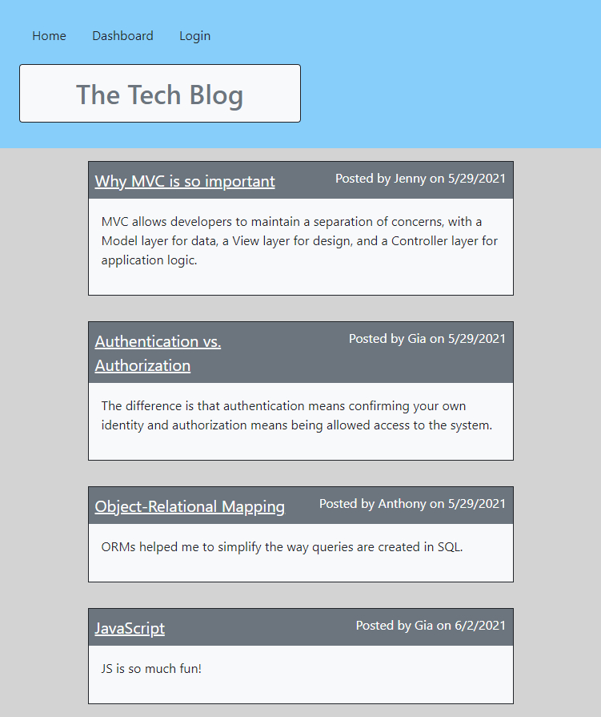

# Model-View-Controller (MVC): Tech Blog

## Description
This application is a CMS-style tech blog built using a MVC (Model-View-Controller) structure, meeting the following criteria.
- On the homepage, existing blogs that have been posted can be seen, along with navigation links for the homepage, the dashboard, and the option to log in.
- While on the homepage, if the other links in the navigation are clicked, the user is prompted to either sign up or sign in.
- If the sign up option is chosen, the user is prompted to create a username and password. These credentials are saved and can be used at other times to log in.
- After logging in, the navigation links for the homepage, the dashboard, and the option to log out appear.
- Clicking on the homepage option presents the existing blog posts that include the post title and the date created.
- If an existing blog post is clicked, the user can view the post title, contents, post creator’s username, the date created, and have the option to leave a comment.
- When the dashboard option is chosen in the navigation, the user will be presented with any blog posts they have already created and the option to add a new blog post.
- If they click on the button to add a new blog post, they will be prompted to enter a title and contents for the blog post, which will be saved. Then an updated dashboard will be presented with the new blog post. 
- Clicking on any of the existing posts in the dashboard enables the user to delete or update the post and take them back to an updated dashboard.
- If they click on the logout option in the navigation, then they will be signed out of the site.

## License
This project is licensed under the MIT license. Click the link below for more info.

[MIT License](https://opensource.org/licenses/MIT)
​
## Installation
After running `npm init -y` and `npm i` in the terminal, the following npm packages were installed: `express-handlebars`, `express`, `MySQL2`, `Sequelize`, `dotenv`, `bcrypt`, `express-session`, and `connect-session-sequelize`.

## Visuals
Click here to view the app: [Tech Blog](url.com)

​
